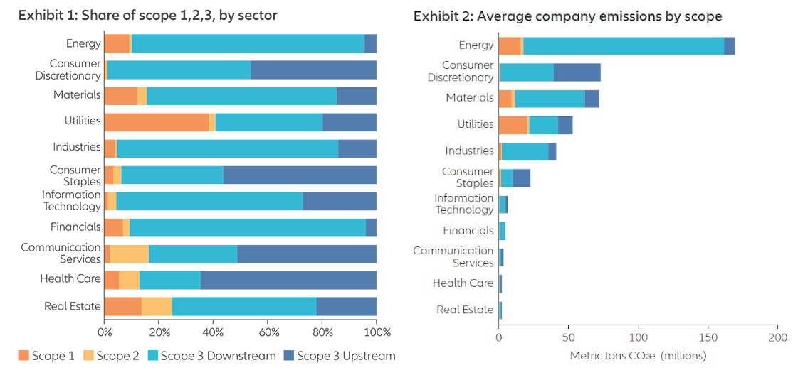
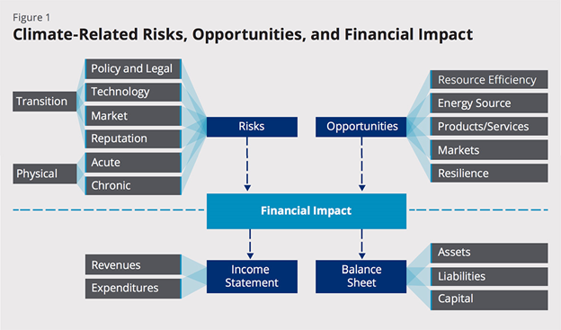

## Scope 1 and Scope 2 Emissions

Visualize the Scope 1 and Scope 2 emissions from the retrieved data.

```{r scope-emissions, echo=FALSE, warning=FALSE, message=FALSE}
library(dplyr)
library(ggplot2)
library(tidyr)
library(knitr)


source("../assets/cover.png")
source("../assets/risk-types.png")
source("../assets/emission_types.png")


source("../r/data_wrangling.R")

# Example data frame simulating data_df
data_df <- data.frame(
  entityId = "US410417775",
  quantitativeInputs.scope1Emission = 77774.65,
  quantitativeInputs.scope2Emission = 15475.56,
  riskTypes.transition = FALSE,
  riskTypes.physical = FALSE,
  riskTypes.combined = TRUE,
  stringsAsFactors = FALSE
)

# Extract Scope 1 and Scope 2 emissions data

emissions_data <- data_df %>%
  mutate(scope1 = quantitativeInputs.scope1Emission,
         scope2 = quantitativeInputs.scope2Emission) %>%
  select(scope1, scope2)

# Plot Scope 1 and Scope 2 emissions



ggplot(emissions_data) +
  geom_bar(aes(x = "Scope 1 Emissions", y = scope1), stat = "identity", fill = "steelblue") +
  geom_bar(aes(x = "Scope 2 Emissions", y = scope2), stat = "identity", fill = "darkorange") +
  labs(title = "Scope 1 and Scope 2 Emissions",
       x = "Emission Type",
       y = "Emissions (tons)") +
  theme_minimal()

# Extract Climate Risk Types data


risk_data <- data_df %>%
  mutate(transition = riskTypes.transition,
         physical = riskTypes.physical,
         combined = riskTypes.combined) %>%
  select(transition, physical, combined)

# Convert to long format for plotting

risk_data_long <- risk_data %>%
  pivot_longer(cols = c("transition", "physical", "combined"), names_to = "risk_type", values_to = "value")

# Plot Climate Risk Types
ggplot(risk_data_long) +
  geom_bar(aes(x = risk_type, y = value, fill = risk_type), stat = "identity") +
  labs(title = "Climate Risk Types",
       x = "Risk Type",
       y = "Presence") +
  theme_minimal()

# Display the final data frame
kable(data_df)


