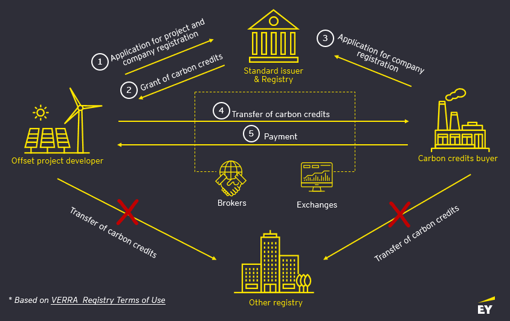
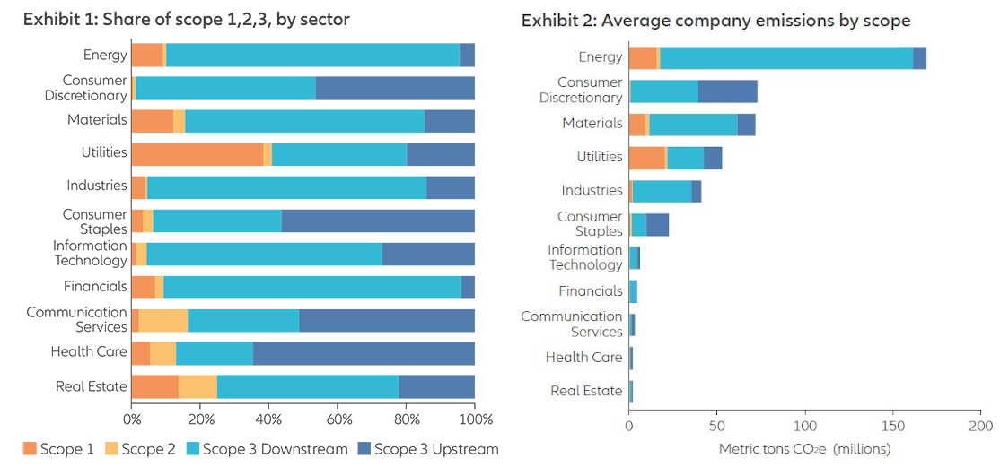

## About the data

**palmerpinguins** (https://allisonhorst.github.io/palmerpenguins) is an R package to provide a great dataset for data exploration & visualization, as an alternative to iris.


```{r packages, include=FALSE, warning = FALSE, message = FALSE}
library(palmerpenguins)
library(dplyr)
library(ggplot2)
```

## Interesting Metrics

We can get some interesting mean metrics for each species:

```{r}
mean_metric <- penguins %>%
  group_by(species) %>%
  select(-year) %>%
  summarize(across(where(is.numeric), mean, na.rm = TRUE))
knitr::kable(mean_metric)
```

```{r, echo = FALSE, out.width='75%'}
# https://allisonhorst.github.io/palmerpenguins/reference/figures/carbon-markets.jpg

```

```{r, include = FALSE}
heaviest_specie <- mean_metric %>%
  filter(body_mass_g == max(body_mass_g)) %>% 
  pull(species)
```

::: {custom-style=highlight-box}
The **`r heaviest_specie`** specie is heavier than other ! 
:::

## Where do they live ? 

```{r species-fig, out.width='60%', echo = FALSE}
# https://allisonhorst.github.io/palmerpenguins/reference/figures/emission_types.png

```

```{r island-repart, echo = FALSE}
ggplot(penguins, aes(x = island, fill = species)) +
  geom_bar(alpha = 0.8) +
  scale_fill_manual(values = c("darkorange","purple","cyan4"),
                    guide = "none") +
  theme_minimal() +
  facet_wrap(~species, ncol = 1) +
  coord_flip()
```
